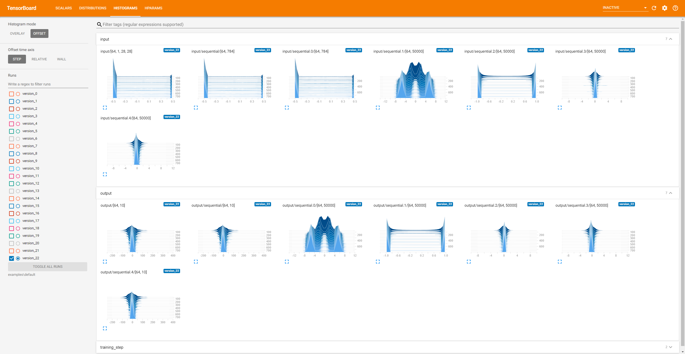

# PyTorch Lightning Snippets
A collection of useful tools around PyTorch Lightning.

```bash
pip install git+https://github.com/awaelchli/pytorch-lightning-snippets
```


## Callbacks

### Monitoring Training Data 

:star: THIS HAS MOVED TO [PYTORCH LIGHTNING BOLTS](https://pytorch-lightning-bolts.readthedocs.io/en/latest/info_callbacks.html#data-monitoring-in-lightningmodule)!  :star:

Callback that logs a histogram of each tensor passed to the `training_step` method. Useful for debugging and sanity checking the pre-processing pipeline.
Currently supports TensorBoard and WandbLogger.

```python 
from monitor import TrainingDataMonitor
from pytorch_lightning import Trainer

model = YourLightningModule()
monitor = TrainingDataMonitor(row_log_interval=25)
trainer = Trainer(callbacks=[monitor])
trainer.fit()
```

<details open>
    <summary>Screenshot</summary>
    <br>
    
</details>


### Monitoring In- and Outputs of Network Layers

:star: THIS HAS MOVED TO [PYTORCH LIGHTNING BOLTS](https://pytorch-lightning-bolts.readthedocs.io/en/latest/info_callbacks.html#data-monitoring-in-lightningmodule)!  :star:

Callback that logs a histogram of each input and output of the specified list of submodules.
Useful for debugging and monitoring custom layers.
Currently supports TensorBoard and WandbLogger.

```python 
from monitor import ModuleDataMonitor
from pytorch_lightning import Trainer

# log the in- and output histograms of LightningModule's `forward`
monitor = ModuleDataMonitor()

# all submodules in LightningModule
monitor = ModuleDataMonitor(submodules=True)

# specific submodules
monitor = ModuleDataMonitor(submodules=["generator", "generator.conv1"])

model = YourLightningModule()
trainer = Trainer(callbacks=[monitor])
trainer.fit()
```

<details>
    <summary>Screenshot</summary>
    <br>
    
</details>


## Model Verification

### Normalization Layers and Biases

It is not a good idea to combine network layers with biases (e.g. Conv) and normalization layers (e.g. BatchNorm). 
Here is a tool that let's you check that this does not accidentally happen while you develop your networks.

```python 
from verification.batch_norm import BatchNormVerification

model = YourPyTorchModel()
verification = BatchNormVerification(model)
valid = verification.check(input_array=torch.rand(2, 3, 4))
```

This will run a forward pass using the provided example input to determine in which order the submodules get executed. 
It will create a list of all layers with bias term directly followed by a normalization layer such as BatchNorm, InstanceNorm, GroupNorm, etc.

There is also a Callback version of this check for PyTorch Lightning:

```python 
from pytorch_lightning import Trainer
from verification.batch_norm import BatchNormVerificationCallback

model = YourLightningModule()
verification = BatchNormVerificationCallback()
trainer = Trainer(callbacks=[verification])
trainer.fit(model)
```

It will print a warning if it detects a bad combination of bias and normalization in your model:

```
Detected a layer 'model.conv1' with bias followed by a normalization layer 'model.bn1'.
This makes the normalization ineffective and can lead to unstable training.
Either remove the normalization or turn off the bias.
```

### Mixing Data Across the Batch Dimension

Gradient descent over a batch of samples can not only benefit the optimization but also leverages data parallelism.
However, you have to be careful not to mix data across the batch. 
Only a small error in a reshape or permutation operation and your optimization will get stuck and you won't even get an error. 
How can you tell if the model mixes data in the batch? 
A simple trick is to do the following: 
1. run the model on an example batch (can be random data)
2. get the output batch and select the n-th sample (choose n)
3. compute a dummy loss value of only that sample and compute the gradient w.r.t the entire input batch
4. observe that only the i-th sample in the input batch has non-zero gradient

If the gradient is non-zero for the other samples in the batch, it means you are mixing data and you need to fix your model!
Here is a simple tool that does all of that for you:

```python 
from verification.batch_gradient import BatchGradientVerification

model = YourPyTorchModel()
verification = BatchGradientVerification(model)
valid = verification.check(input_array=torch.rand(2, 3, 4), sample_idx=1)
```

In this example we run the test on a batch size 2 by inspecting gradients on the second sample. 
The same is available as a callback for your PyTorch Lightning models:

```python 
from pytorch_lightning import Trainer
from verification.batch_gradient import BatchGradientVerificationCallback

model = YourLightningModule()
verification = BatchGradientVerificationCallback()
trainer = Trainer(callbacks=[verification])
trainer.fit(model)
```

It will warn you if batch data mixing is detected:

```
Your model is mixing data across the batch dimension.
This can lead to wrong gradient updates in the optimizer.
Check the operations that reshape and permute tensor dimensions in your model.
```

## Checkpoints

### Snapshot Source Files

This Callback creates a backup of all source files when you start a new training. 
It is useful in case you need to reproduce results using an earlier state of the repository.
Even if you are using git, it could happen that you forget to commit your changes, and then the timestamp of the checkpoint does not match the commit message.

```python 
from pytorch_lightning import Trainer
from checkpoint.code_snapshot import CodeSnapshot

# save all Python source files in cwd to lightning_logs/version_x/checkpoints/code.zip
snapshot = CodeSnapshot()

# save to a specific location
snapshot = CodeSnapshot(output_file="path/to/code.zip")

# choose which files to backup
snapshot = CodeSnapshot(filetype=[".py", ".txt"])

model = YourLightningModule()
trainer = Trainer(callbacks=[snapshot])
trainer.fit(model)
```

You can also create snapshots through the functional interface:

```python 
from checkpoint.code_snapshot import snapshot_files

snapshot_files(root="path/to/my/source", output_file="path/to/code.zip", filetype=[".py", ".ipynb"])
```

### Inspect Checkpoint Files

If you have installed this package using pip or setuptools, there should be a command `peek` available. 
Run `peek --help` for more information about the command.

#### Show top-level contents:

```bash 
peek path/to/checkpoint.ckpt
```
Output:
```bash 
 checkpoint_callback_best_model_path: str = '/home/adrian/test/lightning_logs/version_1/checkpoints/epoch=12.ckpt'
checkpoint_callback_best_model_score: Tensor = 0.8079413175582886
                               epoch: int = 12
                         global_step: int = 295240
                        hparams_name: str = 'args'
                    hyper_parameters: AttributeDict
                       lr_schedulers: list, len=1
                    optimizer_states: list, len=1
           pytorch-lightning_version: str = '1.0.7'
                          state_dict: OrderedDict
```
#### Query specific attributes

```bash 
peek path/to/checkpoint.ckpt global_step hyper_parameters/batch_size
```
Output:
```bash 
                global_step: int = 295240
hyper_parameters/batch_size: int = 10
```

#### Interactive Mode

You can inspect and modify the contents in interactive mode: 

```bash 
peek -i path/to/checkpoint.ckpt
```
Output:
``` 
Entering interactive shell. You can access the checkpoint contents through the local variable 'checkpoint'.
>>> checkpoint["global_step"]
295240
>>> 

```


## Acknowledgement

Thanks to [Tyler Yep](https://github.com/TylerYep) for bringing the batch mixing trick to my attention in this [post](https://github.com/PyTorchLightning/pytorch-lightning/issues/1237).
It is a really good sanity check that is relatively easy to implement and it works great. 
